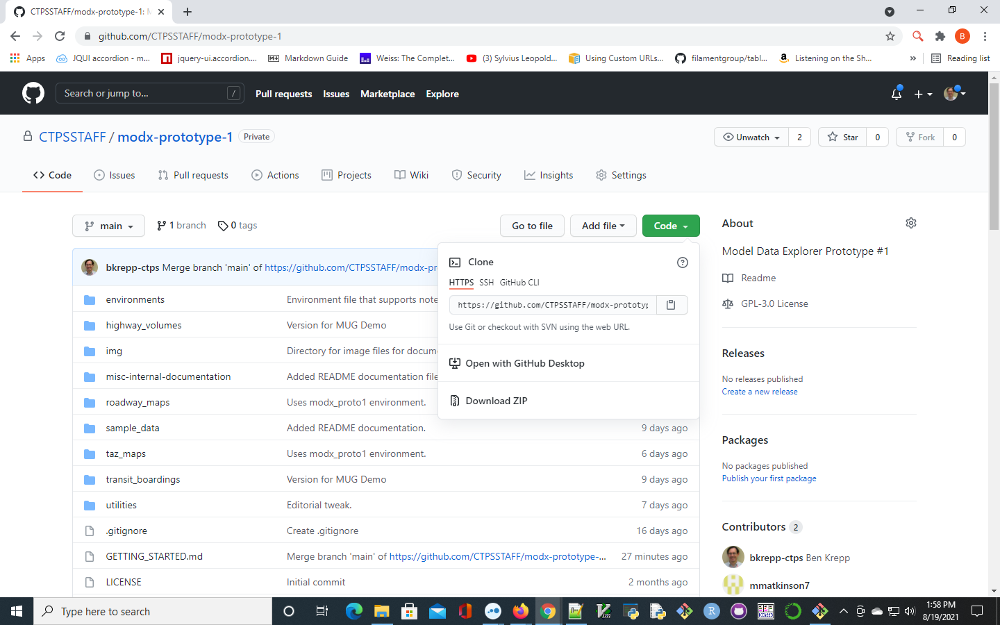

# Getting Started with MoDX

This document is a "Getting Started Guide" for CTPS's Travel Demand Model Data Explorer (a.k.a. __MoDX__.) 
It walks new users through all the steps required to install and run MoDX, including:
* Installing Anaconda 
* Creating a Anaconda _environment_ in which to run MoDX Jupyter notebooks
* Getting your local system ready to run ModDX Jupyter notebooks
* Launching Jupyter notebooks
* Running a MoDX Jupyter notebook
* Closing a MoDX Jupyter notebook 
* Closing down Jupyter notebooks altogether
* The "Emergency Kill-Switch"

## Introduction 

MoDX is a colleciton of [Jupyter](https://jupyter.org) notebooks that allow users without access to a TransCAD machine
and a TransCAD software license to view the inputs to and outputs from CTPS's Travel Demand Model, generate reports, graphs, and maps from this data,
and otherwise to frolic about in what otherwise might appear to be tens of gigabytes of unintelligible gibberish. 

A Jupyter Notebook is an open-source web
application that allows user to create and share documents that contain live code, equations, visualizations and narrative text. The code in MoDX Jupyter notebooks is
written in the [Python](https://python.org) programming language, and makes use of many "packages" in addition to those included in the Python Standard Library.
These packages provide support forsuch things as working with files in [Open Matrix](https://github.com/osPlanning/omx/wiki/Specification) format,
efficiently executing calcutions on large arrays of of numeric data, working with tabular and spatial data in "data frames", 
generating static and interactive graphs, plots, and maps, and so forth.

Because of the many packages required by MoDX, and the subtle dependencies among them, we use [Anaconda](https://www.anaconda.com/) to build and maintain
a consistent set of these packages that is known to work together.
Without such a tool, maintaining a consistent set of packages among the many and varied users of ModDX would become an enormous and time-consuming headache.
Consequently, getting started with MoDX first entails installing Anaconda and creating a correct environment in which
to run MoDX Jupyter notebooks.

## Installing Anaconda and Anaconda Navigator

Install the [Anaconda Individual Edition](https://www.anaconda.com/products/individual).
This installation will require 477 MegaBytes of storage on your hard drive on a Windows 10 system.
The installation includes the Anaconda Shell ("command box") as well as Anaconda Navigator, a graphical front-end to Anaconda.
It is useful to become familiar with both the command-line and graphical interfaces to Anaconda.

Detailed insruction on installing Anaconda are as follows:
1. Navigate [Anaconda Individual Edition Windows Install Page](https://www.anaconda.com/products/individual){target="_blank"}
2. Click the download button for __Anaconda Individual Edition__, and if prompted by your web browser, save the file.
3. Run the downloaded installer, named Anaconda<version #><date><OS/hardware architecture>.exe.
4. Accept the license agreement.
5. Keep the default option to install for "Just Me". (Q: Is this preferred, given that CTPS users have the ability to do administrative installations?)
6. Accept the default installation location.
7. Leave both "advanced" options unchecked . (Do not add Anaconda to the PATH variable, as it could break prior software installations by leading to Anaconda being found before them. Do not register Anaconda as your default Python for similar reasons.)
8. Click the "Install" button, and be patient.   
Note:  
* The installation may appear to stall, as it will likely take ten minutes or more near the end to set up the "package cache" and initial environment. 
* You can click the "Details" button to reveal more of the progress being made.

## Creating an Anaconda Environment for MoDX

A collection of packages that are compatible and work together is called an _environment_ in the Anaconda world.
MoDX requires a specific collection of packages, based on Python version __3.8__.
To create such an environment, you must first obtain a copy of the MoDX GitHub repository.

### Cloning the MoDX GitHub Repository

__If you have Git installed on your computer__:
1. From the Windows 10 start menu, launch a __Git bash__ shell
2. In this __Git bash__ shell, enter the command
```
git clone https://github.com/CTPSSTAFF/modx-prototype-1
```
3. If you entered the _git clone_ command listed above literally, the directory into which the repository was cloned will be named _modx-prototype-1_.

__If you do not have Git installed on your computer__:
1. Open a web browser tab
2. Enter the address https://github.com/CTPSSTAFF/modx-prototype-1 in the address bar, and press ENTER.
3. The page will appear (more-or-less) as follows:


4. Click on on the green __Code__ button in the upper right-hand portion of the page, and select __Download ZIP__.  
5. Save the ZIP file on your computer.  
6. Unpack the ZIP file in an appropriate location.  
7. If necessary, rename the unpacked directory _modx-protype-1_.  

### Creating the Anaconda Environment _per se_

1. Fron the Windows 10 Start menu, select __Anaconda3  (64-bit) > Anaconda Prompt (anaconda3)__. This opens an _Anaconda_ command window.
2. In the __Anaconda command window__, __cd__ into the directory into which you cloned the MoDX GitHub repo:  
```
cd _fullly_qualified_path_to_/modx-prototype-1
```
3. In the __Anaconda command window__, create the _modx_prot1_ environment for MoDX by entering the following command:
```
conda env create -f environments/modx_proto1.yml, being sure to specify the _full path_ to the .yml file.
```

__It will take approximately 15-20 minutes for Anaconda to create the environment to run MoDX on your computer.__

## Gettng Your Local System Ready to Run MoDX

To get your local computer system ready to run MoDX, perform the following steps, after having cloned the MoDX GitHub repository as described above. 
__NOTE: You will need administrative priveleges on your computer in order to execute (some of) these commands.__

1. For the purpose of the rest of this discussion, we'll call the _fully-qualified_ path to the directory into which you cloned the MoDX GitHub repository __my_modx_dir__
2. Set this directory as the default location from which to launch Jupyter notebooks:
3. 1. In an Anaconda command window, type __jupyter notebook --generate-config__
3. 2. This will write to the file __C:\Users\username\\.jupyter\jupyter_notebook_config.py__
4. Browse to the file location, and open it in an editor (such as Notepad++, Vim, Emacs, or VS Code)
5. Search for the following line in the file: # __c.NotebookApp.notebook_dir = ''__
6. Delete the comment character ('#') at the start of this line
7. Replace the _entire_ line with with __c.NotebookApp.notebook_dir = 'my_modx_dir'__
8. Create a "sandbox" folder for output generated by running MoDX Jupyter notebooks. This folder must be in a location to which you have write priveleges, and can have a name of your own chosing:
```
mkdir S:/my_modx_output_dir
```

Notes:
* In step (7) above, note that __my_modx_dir__ _must_ be surrounded in single quotes
* * For example: __c.NotebookApp.notebook_dir = 'S:/my_modx_notebooks'__
* The full path to one's MoDX directory _must_ be delimited by __single__ quotes, and use __forward__ slashes!

## Launching Jupyter Notbooks

To launch any of the MoDX Jupyter notebooks, perform the following steps:
* From the Windows Start Menu, select Anaconda3 (64 bit) > Jupyter Notebook (modx_proto1)
* This will take a few minutes to run; when complete a new tab will open in your default web browser
* The tab will display a 'file browser' view of the directory into which you cloned the MoDX GitHub repository

## Running a MoDX Jupyter Notebook

To launch a particular MoDX Jupyter notebook, perform the following steps:
1. In the 'file browser' tab created in your web browser in the previous step, navigate to the folder containing the Jupyter notebook you want to run.
2. Click on the name of the notebook you wish to run.
3. In a few moments, the notebook will launch in a _new_ tab in your web browser.
4. To run the __entire__ notebook (i.e., all the cells in it), select __Cell > Run All__ from the menu at the top of the page. 
4. 1. _This is not recommended for brand-new users or those who expect to be making changes to the notebook._
5. To run the notebook __one cell at time__ :
5. 1. Click in the first cell in the notebook; this will set the notebook's "focus" to the first cell.
5. 2. Then, click the __Run__ button at the top of the page.
5. 3. The notebook will execute the first cell, and the notbook's "focus" will advance to the next cell.
5. 4. Continue to click the __Run__ button, advancing thorough all the cells in the notebook.  

Note: The amount of time required to execute a cell varies with the amount of computation each cell performs. Some cells may take quite a bit longer than others to execute.
In particular, cells that generate _interactive_ maps of large quantities of geometric polygon data (e.g., TAZ maps) may take as long as a minute to execute.

__For example__, to run the notebook to compute total demand for the auomobile mode by TAZ:
1. In the 'file browser' tab click on the __taz_maps__ folder.
2. Then, click on the notebook named __demand_by_taz_auto_mode.ipynb__ to launch it.

## Shutting Down a MoDX Jupyter Notebook 

To shut down a particular Jupyter notebook, perform the following steps:
1. In your web browser, navigate to the tab with the 'file system view' of your MoDX directory.
2. Scroll to the top of this page.
3. Click on the __Running__ tab.
4.  A list of your running Jupyter notbeooks will be displayed.
5. Navigate to the row listing the notebook you want to shut down.
6. Click on the orange-brown __Stop Kernel__ button.
7. Wait a few moments for the kernel running your notebook to be shut down.
8. When it has shut down, feel free to navigate back to the __Files__ tab in the 'file browser' view.
9. In your web browser, switch to the tab in which your notebook _was_ running.
10. Click the __x__ button on the browser tab to close the tab/
11. When prompted by a pop-up to either stay on the page or to leave it, click the __Leave__ button.

## Shutting Down Jupyter Notebooks Altogether

To compleltey shut down Jupyter notebooks (i.e., shut down the kernel running the notebooks), perform the following steps:
1. In your web browser, navigate to the tab with the 'file system view' of your MoDX directory.
2. Click the __Logout__ button in the upper right-hand corner of this 'file system view' page.
3. You may now close the tab in your web browser labeled "Jupyter Notebook".

## The Emergency Kill-Switch

Anaconda Navigator and/or the Jupyter Notebooks kernel may become unresponsive (i.e., "hang") under certain circumstances,
such as running out of avaialble RAM on your system. (Because of RAM requirements, it is recommended to run at most __one__ 
MoDX Jupyter Notebook at any given time on typical systems with 8 GB of RAM.) 

Under these circumstances Anaconda Navigator can be "killed" on a Windows 10 system as follows:
1 Open a Windows command prompt (a "DOS box")
2. Enter the command:
```
tasklist | findstr "pythonw"
```
3. Note the process-IDs of the list of processes produced by running the previous command
4. For each such process-ID, enter the command:
```
tskill process_ID
```
