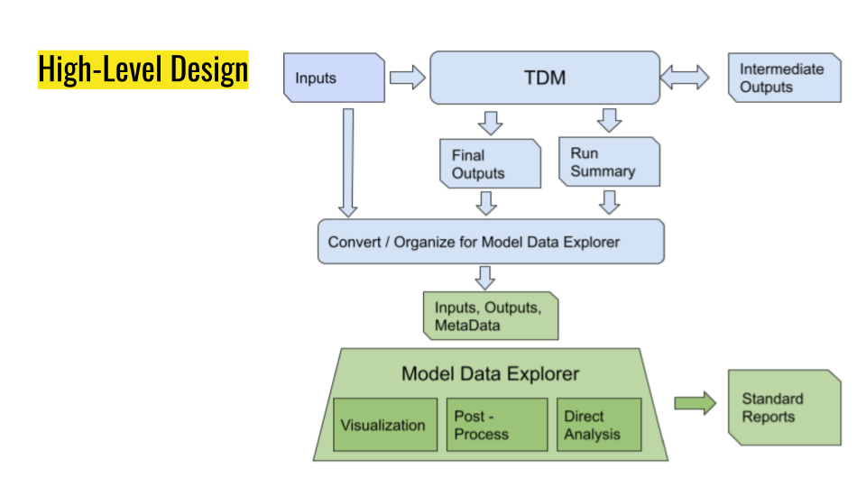

# modx-prototype-1
Model Data Explorer Prototype #1

## Objectives

* Make Travel Demand Model (TDM) input and output data accessible to users without requiring access to a TransCAD machine or software license
* * Reduce contention for TransCAD machines
* * Make model data more easily accessible to modelers
* * Make model data accessible to non-modelers
* Leverage broader set of non-TransCAD skills to develop model reports and summaries

## Requirements

* All data in an open, standards-compliant format
* * OMX, CSV, SHP, JSON, GeoJSON, etc.
* * All relevant data in a proprietary format is exported to one of the above formats
* Open-source implementation 
* * Enables MoDX to be “run anywhere, by anyone”
* * Exploration of model data doesn’t require a TransCAD software license ($$$)
* * Leverage open source community expertise in analysis, visualization, etc.

## Relationship Between the CTPS Travel Demand Model and MoDX

The following figure illustrates the relationship between the CTPS Travel Demand Model and MoDX:

## Implementation - Choice of Platform

* Two principal candidates
* * R / RStudio
* * Python / Jupyter Notebooks
* R / RStudio
* * Looked promising at first, but...
* * Obstacles: Issues with R OpenMatrix (OMX) library, RAM consumption
* Python / Jupyter Notebooks
* * Python OpenMatrix (OMX) library worked “out of the box”
* * RAM consumption issues manageable
* __Python / Jupyter Notebooks__ selected as implementation platform.

## Contents of this Repository

| Directory or File | Contents |
|---|---|
| README.md | This README file. __READ THIS FIRST.__ |
| GETTING_STARTED.md | A "Getting Started" guide for the MoDX Prototype #1. __READ THIS SECOND.__ |
| img | Contains image data used for illustrations in GETTING_STARTED.md. |
| LICENSE | License for code in this repository (GNU GPL v3) |
| .gitignore | File for use by Git version control system. __DO NOT MODIFY.__ |
| config.py | Specify locations of base and (if needed) comparison scenario data, reference data, and your output directory. |
| environments | Anaconda _environments_ for running MoDX Jupyter Notebooks. See GETTING_STARTED.md. __DO NOT MODIFY.__ |
| highway_volumes | Jupyter notebook to generate report and visualization of highway volumes. |
| roadway_maps | Jupyter notebooks to generate reports and visualizations of speed, capacity, and volume/capacity ratio for highway links. |
| taz_maps | Jupyter notebooks to generate reports and visualizations of travel demand, by TAZ. |
| transit_boardings | Jupyter notebooks to generate reports of transit boardings. |
| read_skims | Prototype code for reading travel demand mode "skim" data. |
| utilities | Miscellaneous "utility" code compiled by MoDX developers for incorporation in a "modxlib." __DO NOT MODIFY.__ |
| sample_data | Sample data for running some of the MoDX Jupyter Notebooks. |
| misc-internal-documentation | Miscellaneous pieces of internal documentation created during the development of MoDX prototype #1. __DO NOT MODIFY.__ |
